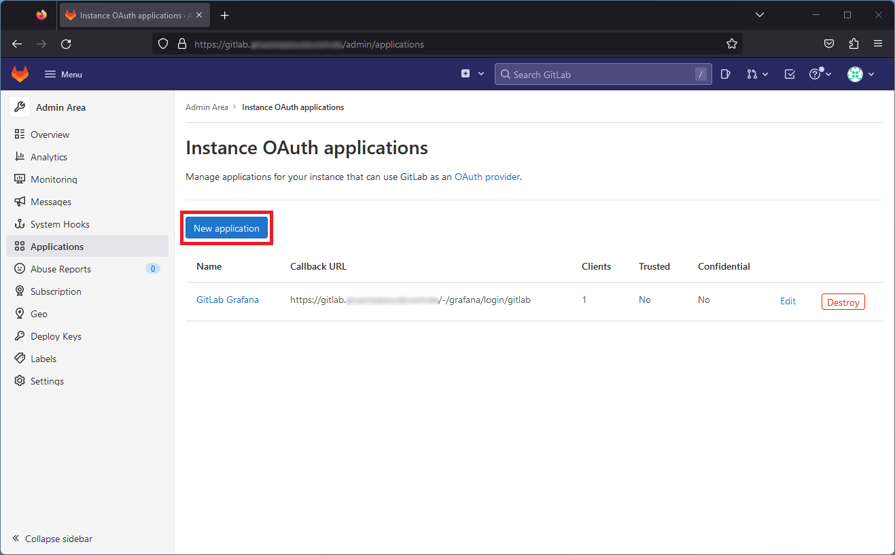

# Outline Wiki with PostgreSQL, Redis, MinIO, MinIO-mc and Traefik in a Docker Compose

## 🗒️ Describe
Images Used:
* [postgresql](https://hub.docker.com/_/postgres)
* [redis](https://hub.docker.com/_/redis)
* [minio](https://hub.docker.com/r/minio/minio/)
* [minio-mc](https://hub.docker.com/r/minio/mc/)
* [outline](https://hub.docker.com/r/outlinewiki/outline)
* [traefik](https://hub.docker.com/_/traefik/)

## ◼️ Install
Install Docker Engine and Docker Compose by following my guide.

```shell
apt-get update
apt-get install ca-certificates curl gnupg
install -m 0755 -d /etc/apt/keyrings
curl -fsSL https://download.docker.com/linux/ubuntu/gpg | sudo gpg --dearmor -o /etc/apt/keyrings/docker.gpg
chmod a+r /etc/apt/keyrings/docker.gpg
echo \
  "deb [arch="$(dpkg --print-architecture)" signed-by=/etc/apt/keyrings/docker.gpg] https://download.docker.com/linux/ubuntu \
  "$(. /etc/os-release && echo "$VERSION_CODENAME")" stable" | \
  sudo tee /etc/apt/sources.list.d/docker.list > /dev/null
apt-get update
apt-get install docker-ce docker-ce-cli containerd.io docker-buildx-plugin docker-compose-plugin
```

Clone the repository to your system and start the deployment using docker compose.

NOTE: Before deployment docker compose, change variables editing .env file.

```shell
cd /opt
git clone https://github.com/alfredotavio/outline-authgitlab-docker.git
cd /opt/outline-authgitlab-docker
mkdir letsencrypt/
touch letsencrypt/acme.json
chmod 600 letsencrypt/acme.json
docker compose up -d
```

```shell
GITLAB_URL= # URL GitLab
POSTGRES_DB= # Database PostgreSQL
POSTGRES_USER= # User PostgreSQL
POSTGRES_PASSWORD= # Password to User PostgreSQL
MINIO_ROOT_USER= # MinIO User Root
MINIO_ROOT_PASSWORD= # Password to MinIO User Root
MINIO_BUCKET_NAME= # Bucket to save images
SECRET_KEY= # Use to generate: openssl rand -hex 32
UTILS_SECRET= # Use to generate: openssl rand -hex 32
OIDC_CLIENT_ID= # ID Token OAuth
OIDC_CLIENT_SECRET= # Secret Token OAuth
WIKI_URL_TRAEFIK= # URL to Outline
MINIO_URL_TRAEFIK= # URL to MinIO
MINIO_ADMIN_URL_TRAEFIK= # URL to MinIO Admin
ACME_EMAIL_TRAEFIK= # Email ACME
```

Follow the steps to generate the OAuth Token for the variables OIDC_CLIENT_ID and OIDC_CLIENT_SECRET.

👉 Step 01 - Sign in to GitLab.


👉 Step 02 - On the top bar, select Menu > Admin.


👉 Step 03 - Click on Applications > New application.




👉 Step 04 - Fill in the following fields:

Name: A name for the OAuth Token.

Redirect URI: The URL that the user will be redirected to after Login. Substitute wiki.example.com for your Outline URL, keep /auth/oidc.callback.

Select: Trusted, Confidential, openid, email.


👉 Step 05 - Copy the Application ID and Secret, replace the variables OIDC_CLIENT_ID and OIDC_CLIENT_SECRET.


## 📂 Structure
```shell
.
├── .env
└── docker-compose.yml
```

## 👨‍💻 Author
<table>
  <tr>
    <td align="center">
      <a href="#">
        <a href="https://www.linkedin.com/in/alfredotavio/"><br>
        <sub>
          <b>Alfredo Castro</b>
        </sub>
      </a>
    </td>
  </tr>
</table>
